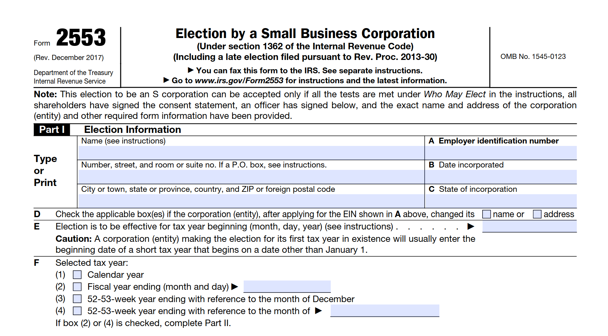

Filling out IRS Form 2553, also known as the "Election by a Small Business Corporation," allows your corporation or LLC to be treated as an S corporation for tax purposes.

Always refer to the most current instructions from the IRS website and consult with a tax professional as necessary. The steps are:

1. **Part 1: Election Information**
    - 1. Enter the name and address of your corporation.
    - 2. Enter the Employer Identification Number (EIN) and the date of incorporation.
    - 3. Write the state and the month your corporation ends its tax year.
    - 4. If applicable, write down the details regarding the business activity and the product or service in which the business is engaged.
    - 5. Check the appropriate box for the fiscal year.
    - 6. Indicate the number of shares of stock your corporation has issued and state when you want the S Corporation status to be effective.

 Please ensure you consult with your accountant or tax advisor before making this election, as it may not be the best choice for every business.

2. **Part II—Election Information**

    Line E. Enter the intended effective date of election. This date should be the day on which the corporation wants S Corporation status to begin. The date can be either in the current tax year or the next tax year.

    Example: If you're filling out the form in 2023 and you want your S Corporation election to be effective from the beginning of 2024, you would enter "01-01-2024."

    Line F. Check the appropriate box for the tax year that you are electing. S Corporations usually use a calendar tax year, but certain conditions allow for a fiscal year to be used. See the instructions to determine which box to check.

    Example: If your S Corporation will operate on a calendar year, check "Calendar year." If you have a business reason to operate on a fiscal year, check "Fiscal year" and enter the month your tax year ends.

    Line G. This line is for corporations that are adopting the calendar year as its tax year and it has NOT revolved around a natural business year. If the corporation's tax year qualifies as a natural business year, you must complete Part II of Form 8716, Election To Have a Tax Year Other Than a Required Tax Year, instead of line G. In most cases, if you are using a calendar tax year, you can just check "No" on this line.

    Example: In most cases, you would check "No" for this line.

    Line H. This is only filled out if the corporation is a new corporation that is choosing to be taxed as an S Corporation from its date of incorporation. If that's the case, check "Yes". Otherwise, you would check "No".

    Example: If the company was incorporated recently and you want it to be an S Corporation from the date of incorporation, you would check "Yes." Otherwise, you would check "No." 

3. **Part III – Qualified Subchapter S Trust (QSST) Election**
   
    Unless you have a specific arrangement with a QSST, you can skip this part. If not, continue below.

Step 1: Shareholder's Consent

Each shareholder must consent to the S Corporation election. This is demonstrated by filling in the following fields:

    Column (a): Name: Write the name of each shareholder as it appears on their tax return.
    Column (b): Identifying number: Input the Social Security Number (SSN) or Employer Identification Number (EIN) of each shareholder.
    Column (c): Number of shares: Write the number of shares each shareholder owns. Make sure the shares are distributed correctly and that all shares are accounted for.
    Column (d): Date Acquired: Indicate the date each shareholder acquired their first block of stock.

Example:
- Column (a): John Doe
- Column (b): XXX-XX-XXXX (John Doe's SSN)
- Column (c): 100 (John Doe's shares)
- Column (d): 01/01/2022 (Date when John acquired his shares)

Step 2: Shareholder's Consent Statement

Each shareholder must sign and date their consent statement in the respective columns:

    Column (e): Signature: Each shareholder must sign to confirm their consent to the S Corp election.
    Column (f): Date: The date the shareholder signed the form.

Example:
- Column (e): John Doe's signature
- Column (f): 07/08/2023 (Date when John signed)

Step 3: Completion

Repeat the above steps for each shareholder until all have consented to the S Corporation election. If additional space is needed for more shareholders, you can attach a separate sheet containing the required information.

Remember, all shareholders must agree to the election for it to be valid.

4. **Part IV – Late Corporate Election Reason**

    If you are filing Form 2553 after the usual deadline, explain why it's late.

5. **Part V – Shareholder’s Consent Statement**

    Every shareholder must sign and date this section, indicating their consent for the S corporation election.

6. **Part VI – Basis for Shareholder’s Consent**

    You usually won't have to fill this section out unless some shareholders haven't consented.

7. **Part VII – Shareholder’s Statement**

    For each shareholder, list:
    - The number of shares they own
    - The date they acquired the shares
    - Their tax year
    - Their Social Security Number or Individual Taxpayer Identification Number

    Example:
    - "John Doe"
    - "100"
    - "01/01/2023"
    - "Calendar Year"
    - "123-45-6789"

8. **Signature**
   
    The form must be signed and dated by the president, vice president, treasurer, assistant treasurer, chief accounting officer or any other corporate officer (such as tax officer) authorized to sign.

9. **Faxing Form 2553**

For corporation whose principal business, office, or agency is located in:
Connecticut, Delaware, District of Columbia, Georgia, Illinois, Indiana, Kentucky, Maine, Maryland, Massachusetts, Michigan, New Hampshire, New Jersey, New York, North Carolina, Ohio, Pennsylvania, Rhode Island, South Carolina, Tennessee, Vermont, Virginia, West Virginia, Wisconsin 

**Fax #: 855-887-7734**

For corporation whose principal business, office, or agency is located in:
Alabama, Alaska, Arizona, Arkansas, California, Colorado, Florida, Hawaii, Idaho, Iowa, Kansas, Louisiana, Minnesota, Mississippi, Missouri, Montana, Nebraska, Nevada, New Mexico, North Dakota, Oklahoma, Oregon, South Dakota, Texas, Utah, Washington, Wyoming

**Fax #: 855-214-7520**
