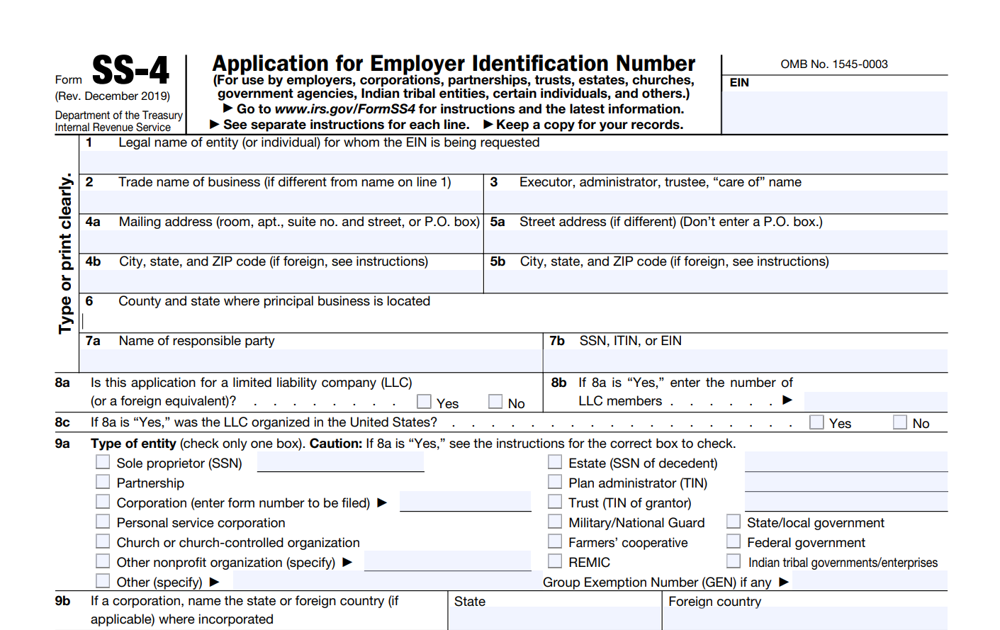

The [SS-4 Form](https://www.irs.gov/pub/irs-pdf/fss4.pdf) is used by the United States Internal Revenue Service (IRS) to apply for an Employer Identification Number (EIN). As of my knowledge cutoff in September 2021, here is a step-by-step guide on how to fill out Form SS-4:

1. **Line 1**: Write the legal name of the entity applying for the EIN. If you're a sole proprietor or individual, use your legal name as shown on your social security card. If you're an LLC, partnership, corporation, or other entity, write the legal name of the entity.

2. **Line 2**: If the entity has a trade name, doing business as (DBA) name, or disregarded entity name, enter it here. If not, leave blank.

3. **Line 3**: Enter the executor, administrator, trustee, "care of" name, or business name. In general, if you're applying for an EIN for an estate or trust, this is where the executor or trustee's name goes.

4. **Line 4a-b**: Write your business address (not a P.O. Box) and mailing address if different from the business address.

5. **Line 5a-b**: Write the name of the responsible party (someone who controls, manages, or directs the entity). Use their social security number (SSN) or individual taxpayer identification number (ITIN) in line 5b. For businesses, this is usually an executive officer (e.g., CEO or CFO).

6. **Line 6**: Write the name of the entity type (e.g., individual, partnership, corporation, etc.).

7. **Line 7a-b**: Enter details about the designated contact person for this application.

8. **Line 8a-c**: Answer the questions related to LLCs. If your business is an LLC, enter the number of LLC members and the state where it was formed.

9. **Line 9a-b**: Select the reason why you're applying for an EIN. 

10. **Line 10**: Indicate the date when the business started or was acquired.

11. **Line 11**: Indicate the closing month of your accounting year (for most businesses, this will be December).

12. **Line 12**: Estimate the amount of annual wages you expect to pay.

13. **Line 13**: Indicate if you expect your employment tax liability to be $1,000 or less in a full calendar year, and you'd like to file Form 944 annually instead of Forms 941 quarterly.

14. **Line 14**: Indicate if you had or will have any employees who will receive W-2s.

15. **Line 15**: Describe the principal activity of your business.

16. **Line 16**: Choose the category that best describes your business.

17. **Line 17**: Indicate if you applied for an EIN for the same business in the past.

18. **Line 18**: If applicable, answer the question regarding state/local agencies.

**After you've completed the form, you can mail or fax it to the IRS using the number 855-215-1627 (within the U.S.) or 304-707-9471 (outside the U.S.)**

However, the IRS encourages you to apply for an EIN online if your principal business is located in the United States or U.S. Territories. The online application process is faster and you'll get your EIN immediately. 
